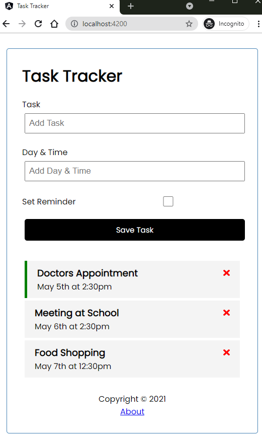
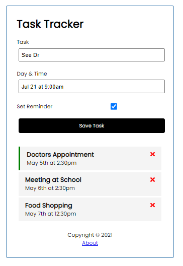
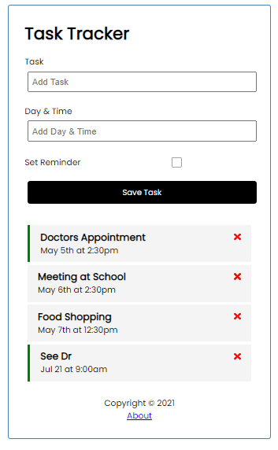
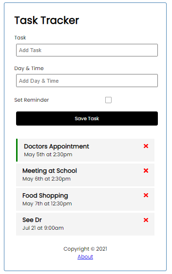

# Task Tracker

Used Angular, JSON Server, RxJS, Font Awesome etc.

## Serve

### JSON server

```
npm run server
or
json-server --watch db.json --port 5000
```

### Task Tracker App

```
npm start
or
ng serve
```

## UI

## List all tasks



## Add a new task





## Toggle reminder

Double click each task will toggle the reminder.



## Delete a task

Click the red cross.


