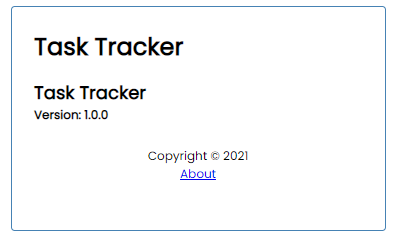

# Task Tracker

Used Angular, TypeScript, JSON Server, RxJS, Router, Font Awesome etc.

## Serve

### JSON server

```
npm run server
or
json-server --watch db.json --port 5000
```

### Task Tracker App

```
npm start
or
ng serve
```

## UI

### List all tasks


### Add a new task


## Toggle reminder

Double click each task will toggle the reminder.


### Delete a task

Click the red cross.


### About



## Knowledge Points

- ng g component ...
- ng g service ...
- ng g interface ...
- ngOnInit, ngOnDestroy ...
- ngModel, ngClass ...
- ngSubmit, ngStyle ...
- ngIf, ngFor ...-
- @Input(), @Output() ...
- HttpClient, HttpHeaders ...
- Injectable, Observable ...
- RouterLink
