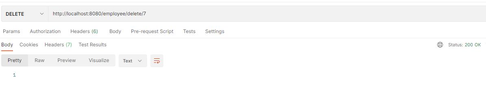

# Employee Manager backend

Used Java Spring Boot, Maven, MySQL, JPA, JUnit, Postman, httpie etc.

## Serve

### MySQL


### Run

```
run EmployeemanagerApplication
```

## REST APIs

### GET all


### Delete



### Add


## Knowledge Points

- JpaRepository
- Serializable
- @Transactional
- CorsFilter
