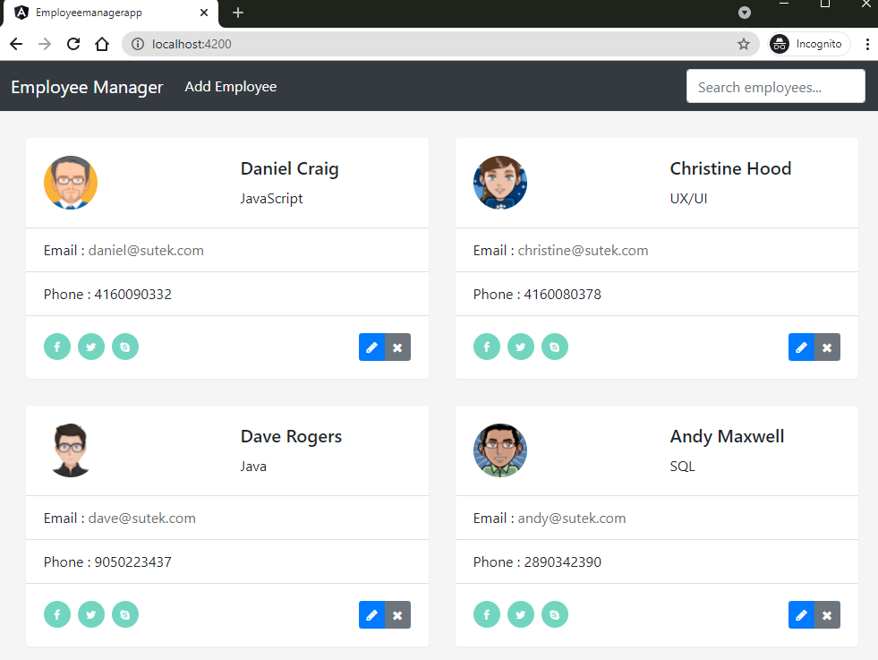
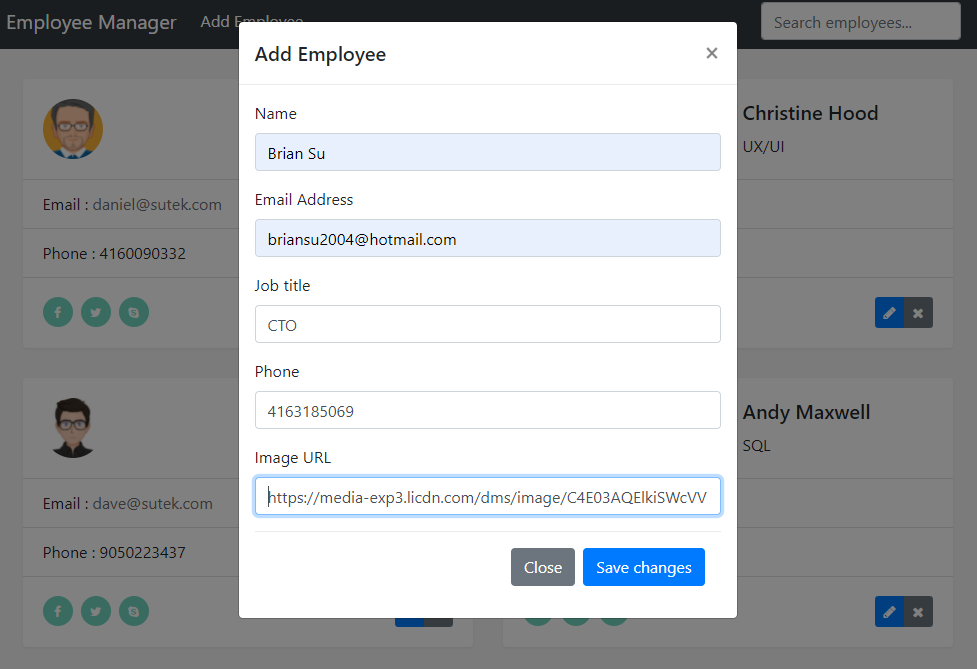
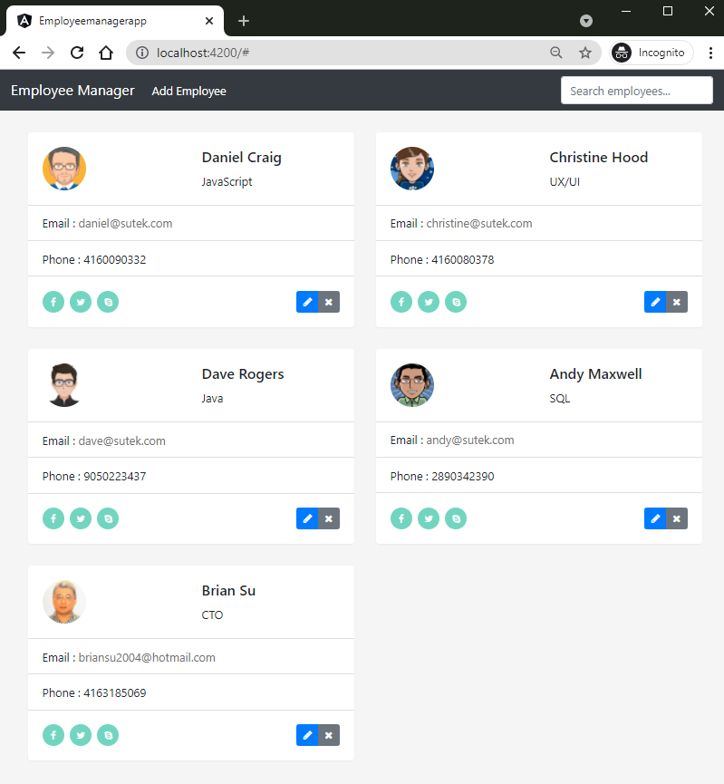
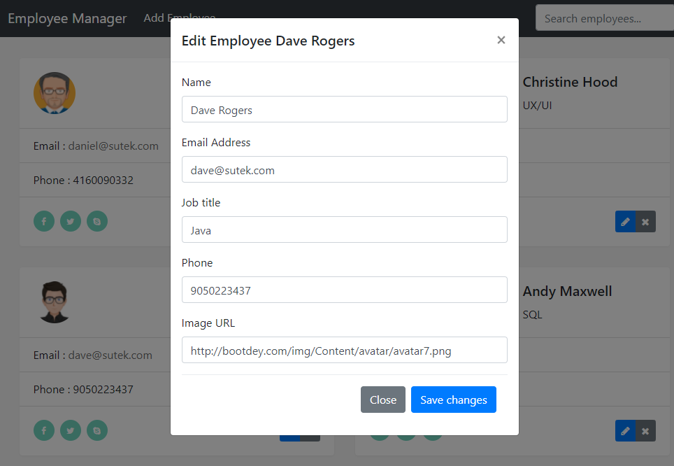
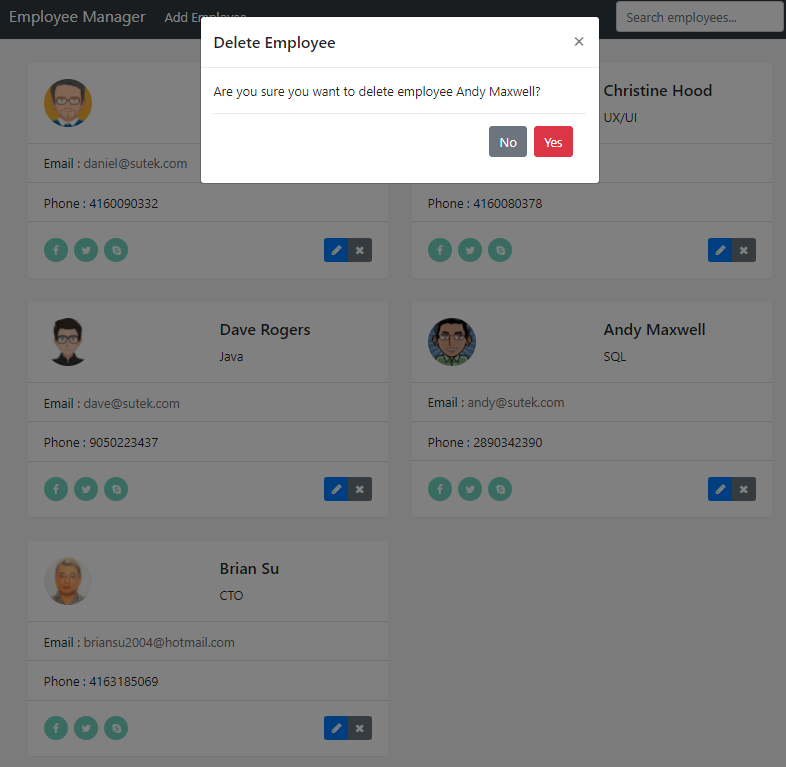
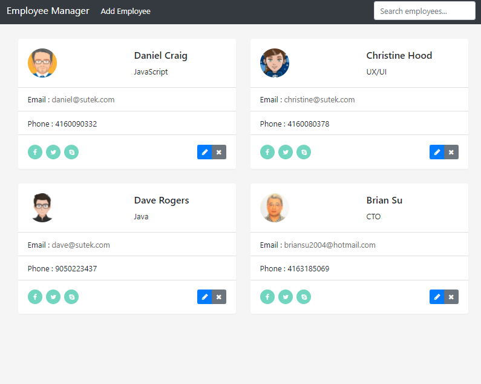
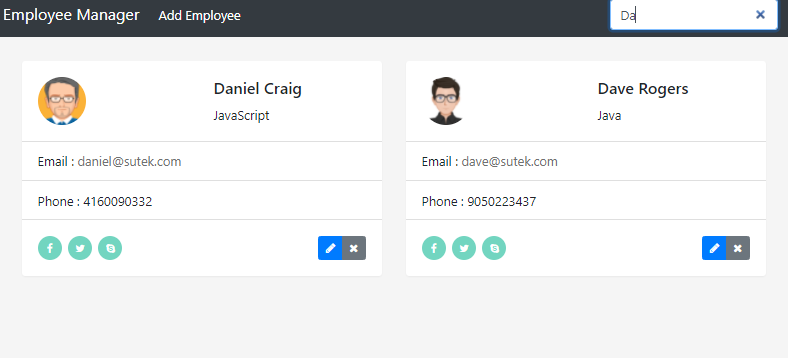

# Employee Manager App frontend

Used Angular, TypeScript, RxJS, jQuery, Ajax, Bootstrap etc.

## Serve

```
npm start
or
ng serve
```

## UI

### List all



### Add





### Edit



### Delete





### Search



## Knowledge Points

- ng g component ...
- ng g service ...
- ng g interface ...
- BrowserModule, HttpClientModule, FormsModule
- subscribe
- HttpClient, HttpHeaders ...
- Injectable, Observable ...
- Modal
- ngModelChange ...
- ngForm, ngSubmit ...
- ngIf, ngFor ...
