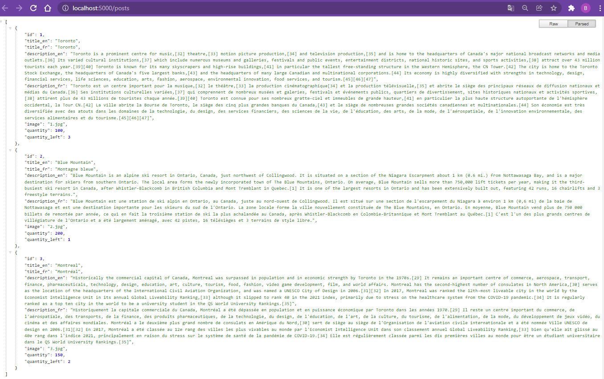

# Ngx Translate Simple

## Commands

```dos
npm i -g @angular/cli

ng new ngx-translate-simple --routing --style=scss

bootstrapcdn.com
v5.1.3

ng serve

ng g c nav
ng g c posts

ng v
npm i -S @ngx-translate/core@13
npm i -S @ngx-translate/http-loader@6
```

Mind the versions -

npm i -S @ngx-translate/core
npm i -S @ngx-translate/http-loader

Angular @ngx-translate/core @ngx-translate/http-loader
13 (ivy only) 14.x+ 7.x+
10/11/12/13 13.x+ 6.x+

index.html

```html
<link
  rel="stylesheet"
  href="https://cdn.jsdelivr.net/npm/bootstrap@5.1.3/dist/css/bootstrap.min.css"
  integrity="sha384-1BmE4kWBq78iYhFldvKuhfTAU6auU8tT94WrHftjDbrCEXSU1oBoqyl2QvZ6jIW3"
  crossorigin="anonymous"
/>
```

## Knowledge Points

### Bootstrap CSS

### LocalStorage

### Interceptor

### CORS

## Screenshot




## Appendix

### npm install different/older version

npm i <module>@<version>

### css to scss

```dos
ng g schematics-scss-migrate:scss-migrate --dry-run=true
ng g schematics-scss-migrate:scss-migrate

ng config schematics.@schematics/angular:component.style scss

npm i -g renamer
```

angular.json

```json
    "styles": ["src/styles.scss"],
```
